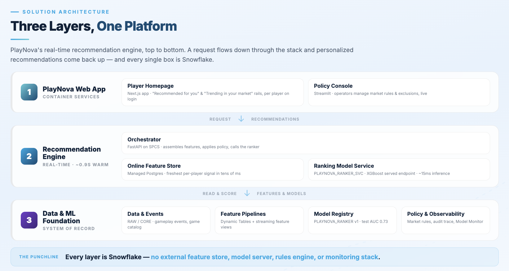

# PlayNova — Real-Time Game Recommendations on Snowflake

A fully **Snowflake-native** reference implementation of a real-time game
recommendation system for a fictitious iGaming operator, **PlayNova**. It pairs
**batch** feature engineering (Dynamic Tables) with **real-time** features
(Online Feature Store on a dedicated managed Postgres) and serves ranked,
policy-compliant recommendations through an SPCS FastAPI orchestrator to a
branded web app, with a Streamlit console for business-rule control.

Every layer — data, features, model training, model serving, the API, the web
app, the policy console, and observability — runs **inside Snowflake**. There is
no external feature store, model server, rules engine, or monitoring stack.

---

## Demo

A full end-to-end walkthrough of the deployed demo — login → personalized rails →
real-time recommendation shift after gameplay → policy control → telemetry &
observability:

**[▶ Watch the demo walkthrough (Zoom clip)](https://snowflake.zoom.us/clips/share/apPrrIP-Qi2X0p_lMSEYww)**

---

## Architecture



### Layer 1 — Presentation (PlayNova web app, Next.js on SPCS)
A dark-purple branded casino shell. Players **register** (choosing a market),
**log in**, browse personalized **rails** ("Recommended for you", "Trending in
your market", "Because you played X"), open a **game page**, and click **Play**
to simulate gameplay. The app talks only to the orchestrator — it contains no
business logic. A **Telemetry** page renders the real per-request call-stack
waterfall read live from the recommendation trace.

### Layer 2 — Recommendation engine
- **Orchestrator (SPCS, FastAPI)** — the single backend entry point.
- **Online Feature Store (Postgres)** — low-latency online features. The online
  service auto-provisions its **own dedicated managed Postgres** (net-zero: no
  dependency on any pre-existing instance; torn down with the demo).
- **Real-time ranker model (XGBoost)** — scores already-eligible candidates;
  registered in the **Snowflake ML Model Registry**, **served as a real-time
  inference service** on SPCS, and watched by an **ML Observability model
  monitor** (segmented by market).
- **Candidate construction + policy** — deterministic eligibility and rule
  enforcement that happens **before** scoring.

### Layer 3 — Policy control (Streamlit console)
Operators manage **market availability**, **market category exclusions**,
**player category exclusions**, and **player subvertical exclusions**, preview
the **eligible catalog**, see **why** items are suppressed, and view a
**what-changed** diff. Rules are written to `APP` tables and take effect on the
**next** recommendation request.

### Foundation — Snowflake data + ML
`CORE` dimensions/facts, `RAW` event history, `APP` policy + output/trace tables,
`FEATURES` Dynamic Tables, the Feature Store (entities, batch/stream/realtime
feature views, the `PLAYER_REC_FG` feature group), the Snowflake ML Model
Registry, the ranker **inference service**, and its **ML Observability monitor**.

---

## Where the model / ML code lives

The recommendation intelligence is spread across a few well-defined files. This
is the map of **where training and inference actually happen**:

| Concern | File | What it does |
|---------|------|--------------|
| **Feature engineering (batch)** | [`sql/03_dynamic_tables.sql`](sql/03_dynamic_tables.sql) | 5 Dynamic Tables: player behavior, long-term category affinity, game catalog profile (popularity/trend/RTP), market-eligible universe, player-game interaction (training labels). |
| **Feature Store + online serving** | [`ml/feature_store.py`](ml/feature_store.py) | Registers entities, batch/stream/realtime feature views, and the `PLAYER_REC_FG` feature group; provisions the **online service (dedicated managed Postgres)** and materializes online features. |
| **Model training** | [`ml/train.py`](ml/train.py) | Trains the **XGBoost ranker** (`PLAYNOVA_RANKER`, 6 features incl. a monotone real-time recency feature) and a batch **propensity** model (`PLAYNOVA_PROPENSITY`); registers both in the **Model Registry**. Training-serving parity is enforced: the feature vector + normalization match the orchestrator exactly. |
| **Model serving (real-time)** | [`ml/deploy_inference.py`](ml/deploy_inference.py) | Deploys the registered ranker as a **real-time inference service on SPCS** (`ML.PLAYNOVA_RANKER_SVC`). No model artifact is baked into any container image — inference is Snowflake-served. |
| **Request-time scoring + policy** | [`services/orchestrator/app.py`](services/orchestrator/app.py) | The FastAPI orchestrator: reads online features, assembles the candidate feature vectors in one Snowflake query, enforces policy **before** scoring, calls the served ranker, diversifies, and persists the top-N + a full trace. This is the real-time inference path. |
| **ML Observability** | [`sql/06_ml_observability.sql`](sql/06_ml_observability.sql) + [`ml/backfill_inference.py`](ml/backfill_inference.py) | Inference log + baseline tables and the **Model Monitor** (drift / volume / statistics, segmented by region). Every served prediction is logged. |
| **Model metrics** | [`ml/set_model_metrics.py`](ml/set_model_metrics.py) | Logs the real held-out test AUC (≈ 0.76) onto the registered model version. |

---

## Data flow

### Homepage request path (1–6 on the diagram)
1. **Request.** The web app calls `POST /recommendations` with the player id,
   resolved **market** (region), and **page context**.
2. **Real-time signal.** The orchestrator reads the player's freshest real-time
   signal from the **Online Feature Store** (Postgres) via the query REST API —
   per-category recent activity and rolling 1h/24h play counts / stake. (If an
   online read is unavailable it falls back to the raw event stream so the demo
   never breaks.)
3. **Assembly + policy (one Snowflake query).** A single query joins long-term
   **affinity** and **behavior** features and the **game catalog profile**,
   enforces the **market-eligible** universe, applies **player-level exclusions**
   (category / subvertical), and computes the ranker's feature vector. All
   filtering is **deterministic and happens before scoring**; every suppression
   is recorded with a reason.
4. **Ranking (served in Snowflake).** The eligible candidate set is scored by the
   **XGBoost ranker**, served as a Model Registry **real-time inference service**
   on SPCS. If the service is unavailable the request **fails cleanly** (503)
   rather than scoring locally. Every served prediction is logged for **ML
   Observability**.
5. **Persist.** Top-N per rail is written to `APP.RECOMMENDATION_OUTPUT` and a
   full **trace** (candidate-set size, rules applied, excluded-with-reason,
   latency breakdown, model version) to `APP.RECOMMENDATION_TRACE`.
6. **Response.** Ranked, diversified **cards** (with tile art) are returned for
   the rails and rendered by the app.

### Fake-play path (A–C on the diagram)
- **A.** The player clicks **Play**; the app calls `POST /events` with a `PLAY`
  event (player, game, category, market, stake).
- **B.** The orchestrator writes the event to `RAW.GAMEPLAY_EVENTS` (system of
  record).
- **C.** The same event is **stream-ingested** into the Online Feature Store, so
  the rolling stream feature views reflect it within seconds. The next homepage
  request (steps 1–6) then returns **updated** recommendations — closing the
  real-time loop.

---

## Repository layout

```
.
├── app/                     Next.js web app (Layer 1) — SPCS container
├── services/orchestrator/   FastAPI orchestrator (Layer 2) — SPCS container
├── streamlit/               Streamlit policy console (Layer 3)
├── ml/                      Feature store, training, serving, observability (Python)
├── sql/                     DDL, mock data, Dynamic Tables, RBAC, observability
├── deploy/                  Phased deploy script + SPCS/Streamlit deploy SQL
├── skill/                   Cortex Code deployment skill (SKILL.md)
├── tests/                   pytest ML-integrity + end-to-end smoke suites
└── docs/                    Architecture diagram (architecture.png)
```

---

## Deploy & operate

The demo is **net-zero**: it creates its own database, dedicated managed Postgres
(via the OFS online service), compute pool, roles, and PAT, and the `teardown`
phase removes all of it.

### Prerequisites
- An account with the **Online Feature Store (Postgres) preview** enabled and SPCS.
- Role with ACCOUNTADMIN-equivalent privileges (CREATE DATABASE / ROLE /
  COMPUTE POOL / SERVICE).
- `snow` CLI ≥ 3.x with a configured connection, **Node ≥ 18**, and **Docker**
  running and signed in.
- Python venv with `snowflake-ml-python >= 1.41` (created/validated in P0).

### Option A — deploy manually (shell)

Run the whole pipeline, or a single phase, with `deploy/deploy.sh`. `CONN` is the
name of your `snow` CLI connection.

```bash
CONN=<connection> deploy/deploy.sh all        # full pipeline: P0 preflight → P5 validate
CONN=<connection> deploy/deploy.sh features   # run a single phase
CONN=<connection> deploy/deploy.sh teardown   # remove everything (net-zero)
```

| Phase | Command | What it does |
|-------|---------|--------------|
| **P0** preflight | `deploy.sh preflight` | venv + deps, Docker/Node/snow checks, **OFS readiness gate**. |
| **P1** bootstrap | `deploy.sh bootstrap` | DB `PLAYNOVA_RECS_DEMO`, schemas, tables, image repo, compute pool. |
| **P2** data | `deploy.sh data` | 12 regions, 12 categories, 240 games, 4000 segmented players, ~1M rounds, seeded policies, tile art. |
| **P3** features | `deploy.sh features` | Dynamic Tables, FS RBAC roles, PAT + `APP.OFS_PAT` secret, Feature Store + online service + feature views, XGBoost ranker + propensity registered. |
| **P3b** inference | `deploy.sh inference` | Serve the ranker on SPCS + create the ML Observability Model Monitor. |
| **P4** apps | `deploy.sh apps` | Build/push images, deploy combined SPCS service `PLAYNOVA_APP` (web + orchestrator) + Streamlit `POLICY_CONSOLE`. |
| **P5** validate | `deploy.sh validate` | `pytest tests/` — ML/data integrity + end-to-end smoke suite; prints the public web endpoint. |
| teardown | `deploy.sh teardown` | Drops services, Streamlit, online service, pool, DB (cascade), FS roles, PAT. **Net-zero.** |

### Option B — deploy via the Cortex Code skill

This repo ships a **Cortex Code deployment skill** at
[`skill/SKILL.md`](skill/SKILL.md). In Cortex Code, from the project directory,
ask the agent to deploy the demo — for example:

```
Deploy the PlayNova real-time recommendations demo using the skill in skill/SKILL.md
```

The skill wraps the same phased pipeline (P0 → P5 + teardown), adds the critical
Online Feature Store deployment lessons (create the online service before
registering online feature views, register stream feature views once on a clean
schema, etc.), and documents the objects it creates and how to troubleshoot them.

### Deployed objects
- Combined SPCS service `PLAYNOVA_RECS_DEMO.APP.PLAYNOVA_APP` — the branded
  Next.js web app (public endpoint) and the FastAPI orchestrator in one pod.
- Streamlit `PLAYNOVA_RECS_DEMO.APP.POLICY_CONSOLE` — the operator policy console.
- Feature Store `FEATURES` + online service (dedicated managed Postgres); models
  `PLAYNOVA_RANKER` / `PLAYNOVA_PROPENSITY` in the Model Registry.
- Ranker inference service `PLAYNOVA_RECS_DEMO.ML.PLAYNOVA_RANKER_SVC` (SPCS) and
  model monitor `PLAYNOVA_RECS_DEMO.ML.PLAYNOVA_RANKER_MONITOR` (ML Observability).

**Web endpoint:** `SHOW ENDPOINTS IN SERVICE PLAYNOVA_RECS_DEMO.APP.PLAYNOVA_APP`
(SPCS ingress requires an interactive Snowflake login). The Streamlit console
opens from Snowsight → Streamlit.

> **Note on demo data.** Player IDs `1…4000` always exist, but each player's
> segment, market, and affinities are generated randomly per deploy — so pick any
> `LIVE_HIGH_ROLLER` / `SLOT_GRINDER` / `SPORTS_BETTOR` to see personalization and
> the real-time shift. Policy rules are managed live from the Streamlit console.

---

## Tests

```bash
SNOWFLAKE_PAT="$(cat .pat_token)" .venv/bin/python -m pytest tests/ -v
```
- `tests/test_ml.py` — catalog/Dynamic-Table integrity, affinity skew, market
  eligibility, Model Registry, Online Feature Store ingest round-trip.
- `tests/test_smoke.py` — end-to-end (register → recommend → fake-play →
  real-time rail change → market-block suppression → player-exclusion logging)
  via an in-process FastAPI client against the live account.

---

## Key design decisions

- **Net-zero Postgres.** The online service provisions a dedicated managed
  Postgres; we never reuse an existing instance, and teardown removes it.
- **Policy before ML.** Eligibility and exclusions are enforced deterministically
  before ranking, so the model can never surface a blocked game.
- **Training–serving parity.** The `PLAYER_REC_FG` feature group backs both the
  offline training set and online retrieval; the ranker's feature vector and
  normalization are identical in `ml/train.py` and the orchestrator.
- **Snowflake-served inference.** Ranking runs **only** on the served model —
  there is no local scoring path (Snowflake or a clean 503). Online feature reads
  still fall back to the offline Dynamic Tables / raw events for resilience.
- **Observability.** Every recommendation persists a replayable trace, and every
  served prediction feeds an **ML Observability model monitor** (drift / volume /
  statistics, segmented by market).

---

## References & further reading

Snowflake Online Feature Store (Postgres) preview — the capabilities this demo
is built on:

- **[Stream Feature Views](https://docs.snowflake.com/en/LIMITEDACCESS/online-feature-store-preview#stream-feature-views)** —
  ingest raw event streams directly through a REST API and use Python UDF
  transformations to compute fresh features in under two seconds from ingest to
  serving. *(Powers the fake-play → real-time recommendation loop in this demo.)*
- **[Real-Time Feature Views](https://docs.snowflake.com/en/LIMITEDACCESS/online-feature-store-preview#real-time-feature-views)** —
  compute features on the fly using data available at request time (e.g. current
  transaction amount, device context, session metadata). Combine derived features
  from upstream feature views with request-time inputs, or apply post-processing
  before serving.
- **[Feature Groups](https://docs.snowflake.com/en/LIMITEDACCESS/online-feature-store-preview#feature-groups)** —
  logically group related views for consistent management and reuse across
  training and inference. *(This demo's `PLAYER_REC_FG` groups the ranker's
  features.)*
- **[Snowflake Feature Store Quickstart (Online Feature Store on Postgres)](https://github.com/snowflake-labs/sf-samples/blob/main/samples/ml/feature_store/online_feature_store_postgres_quickstart.ipynb)** —
  end-to-end notebook walkthrough of the Online Feature Store.
